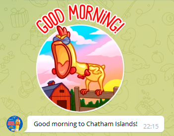

# timely-greeter-bot



This is a Telegram bot that greets users at 9 am.

9 am, which timezone? All of them.

So at 9 am UTC it send something like "Good morning Canary Islands, Lisbon and
London" if DST is not enabled, or "Good morning Azores" if it is. At 8 am UTC it
will send "Good morning Berlin, Paris, and Madrid" if DST is not active, or "Good
morning Canary Islands, Lisbon and London" if it is. And that for almost every
timezone that there is in the world.

It's not meant to be very useful, just a way to annoy a friend who complained that
I'd greet them with a "good morning" sticker in the evening.

## Setup

First, make sure that you have set up your Rust toolchain correctly. Check out
the [instructions](https://rust-lang.github.io/rustup/installation/index.html)
in the official Rust documentation.

You need a Telegram bot token to actually run a bot. If you don't have one, get it
from [BotFather](https://t.me/BotFather) in Telegram.

Then clone the repo if you haven't already, and create an `.env` file with a
Telegram bot token.

```
TELEGRAM_BOT_TOKEN=<your token here>
```

Then `cargo run` normally, or `cargo build` depending on whether you want a
debug or a production build.

Once the app is running, it will receive any messages that your bot is sent
in Telegram and add the chat ID to a `chat_ids.txt` file (note that this bot does
not have any DB dependencies). It will then send messages to each active chat when
it's time to greet users.

## Bot usage

- `/start` (or anything else, really) signs up a user to start receiving greetings.
- `/stop` unsubscribes a user.
